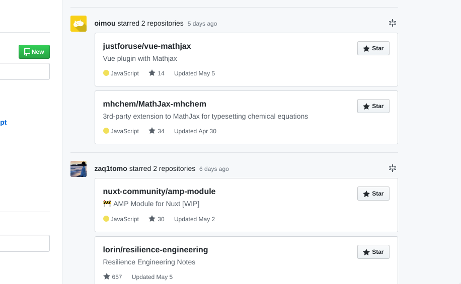
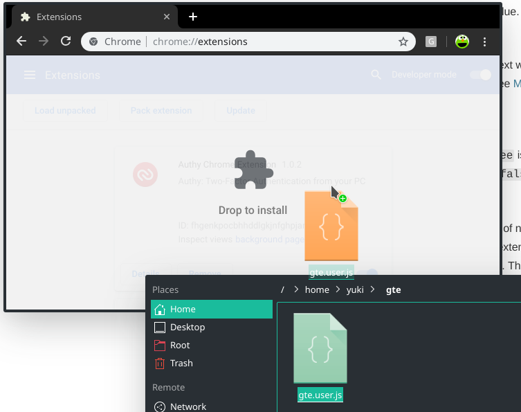

# GitHub Timeline Expander

Expand initially.

## Installation to your browser

This is a UserScript.

In Chrome, Just drag and drop the script to extension page.

[Download Script](../../raw/master/gte.user.js)
